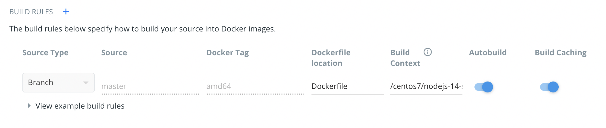

# docker-nodejs-16-centos7-slim
This image provides CentOS 7 with Node.js 16.x.x and NPM installed.

# Tags
This image has no specific tag except `latest`.

# Supported architectures
Typical x86 systems and Apple Silicon Macs:

- `amd64`
- `arm64`

[More info](https://github.com/docker-library/official-images#architectures-other-than-amd64).

# Multi architecture build
```shell
# typical x86 systems and Apple Silicon Macs
docker buildx build --platform linux/amd64,linux/arm64 --push -t adrienv1520/nodejs-16-centos7-slim .
```

Having issues building with buildx on Apple M1:
1. Configure automated builds on Docker Hub and use tag `amd64`, example:

2. Build and push image locally for `arm64` arch on a Apple M1:
```shell
docker build -t adrienv1520/nodejs-16-centos7-slim:arm64 .
docker push adrienv1520/nodejs-16-centos7-slim:arm64
```
3. Create manifest
```shell
docker manifest create adrienv1520/nodejs-16-centos7-slim:latest adrienv1520/nodejs-16-centos7-slim:amd64 adrienv1520/nodejs-16-centos7-slim:arm64
docker manifest push --purge adrienv1520/nodejs-16-centos7-slim:latest
```

# Usage
You can use this image as a base for other Docker images, by using `FROM adrienv1520/nodejs-16-centos7-slim` in your Dockerfile.

Otherwise, you can also use this image as stand-alone. For example, if you run:
```shell
docker run --rm --name nodejs16c7slim -it adrienv1520/nodejs-16-centos7-slim /bin/bash
```

You'll have a bash terminal opened in a container with CentOS 7, Node.js 16.x.x and NPM.

# Additional information
Node.js and NPM have been installed using the procedure described at: [NodeSource Node.js Binary Distributions](https://github.com/nodesource/distributions#rpminstall).
